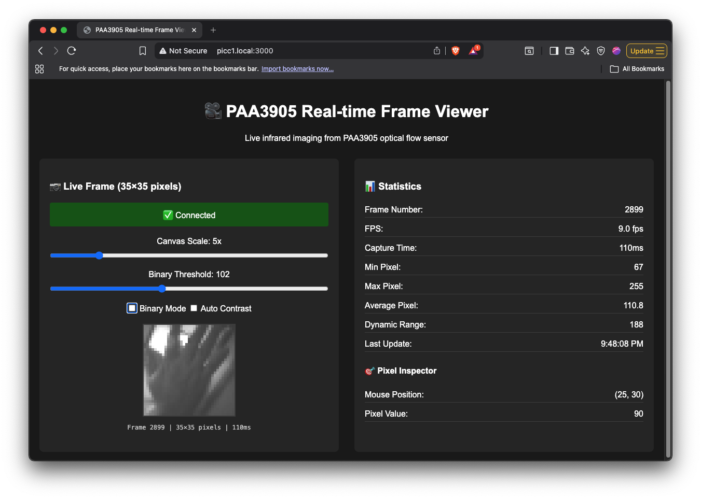

# PAA3905 Node.js Library

A Node.js library for the PAA3905 optical flow sensor, ported from the original Arduino library by [Simon D. Levy](https://github.com/simondlevy/PAA3905). This library provides motion detection and raw image capture capabilities using SPI communication.

## Table of Contents

- [Features](#features)
- [Hardware Requirements](#hardware-requirements)
- [Installation](#installation)
  - [1. Install the Library](#1-install-the-library)
  - [2. Enable SPI](#2-enable-spi)
  - [3. Configure Permissions](#3-configure-permissions)
- [Hardware Connections](#hardware-connections)
- [Basic Usage](#basic-usage)
  - [Motion Capture](#motion-capture)
  - [Frame Capture](#frame-capture)
- [API Reference](#api-reference)
  - [PAA3905_MotionCapture](#paa3905_motioncapture)
  - [PAA3905_FrameCapture](#paa3905_framecapture)
  - [Configuration Constants](#configuration-constants)
- [Web Demo - Real-time Frame Streaming](#web-demo---real-time-frame-streaming)
  - [Features](#features-1)
  - [Quick Start](#quick-start)
  - [Configuration](#configuration)
  - [Web Interface Controls](#web-interface-controls)
- [Testing](#testing)
  - [Basic Connection Test](#basic-connection-test)
  - [Motion Capture Test](#motion-capture-test)
  - [Frame Capture Test](#frame-capture-test)
- [Performance Specifications](#performance-specifications)
- [Troubleshooting](#troubleshooting)
  - [Permission Denied](#permission-denied)
  - [No SPI Devices](#no-spi-devices)
  - [Sensor Not Detected](#sensor-not-detected)
  - [Poor Motion Data Quality](#poor-motion-data-quality)
- [License](#license)
- [Credits](#credits)

## Features

- **Motion Capture**: Read optical flow motion deltas (X, Y) for navigation and tracking
- **Frame Capture**: Capture raw 35×35 pixel infrared images at ~15 Hz
- **Multiple Detection Modes**: Standard and enhanced detection for different environments
- **Auto Light Mode**: Automatically switches between bright, low, and super-low light conditions
- **Data Validation**: Built-in quality thresholds for reliable motion data
- **Promise-based API**: Modern async/await compatible interface
- **TypeScript Ready**: Includes TypeScript type definitions

## Hardware Requirements

- Linux-based system (Raspberry Pi, etc.)
- PAA3905 optical flow sensor module (e.g. [PAA3905 Breakout Board](https://www.tindie.com/products/onehorse/paa3905-optical-flow-camera/))
- SPI interface enabled
- Node.js 20+ with build tools

## Installation

### 1. Install the Library

```bash
npm install @eeemarv/io-spi
# Clone or copy this library to your project
```

### 2. Enable SPI

**Raspberry Pi:**
```bash
sudo raspi-config
# Navigate to Interface Options > SPI > Enable
```

Or if you'd like to enable SPI1 instead of SPI0, please comment out the following line in `/boot/config.txt`:
```bash
# dtparam=spi=on
```

And add the following lines to enable SPI1, with GPIO18 as CS0 (`SPI1-CEO-N`) while GPIO17 as CS1 (`SPI1-CE1-N`):
```bash
dtoverlay=spi1-2cs
```

After making these changes, reboot your Raspberry Pi for the new SPI configuration to take effect. You can verify that SPI is enabled and the devices are available by running:
```bash
ls -l /dev/spidev*
```

### 3. Configure Permissions

Create an SPI group and configure udev rules:

```bash
# Create SPI group
sudo groupadd spi

# Create udev rule
sudo nano /etc/udev/rules.d/90-spi.rules
# Add this line:
# SUBSYSTEM=="spidev", GROUP="spi", MODE="0660"

# Reload udev rules
sudo udevadm control --reload-rules
sudo udevadm trigger

# Add user to SPI group
sudo usermod -aG spi $(whoami)
# Log out and back in for group changes to take effect
```

## Hardware Connections

Connect PAA3905 to `SPI0` of Raspberry Pi as follows:

| PAA3905 Pin | Raspberry Pi | Description |
|-------------|--------------|-------------|
| MOSI        | GPIO10       | Data out |
| MISO        | GPIO9        | Data in |
| SCLK        | GPIO11       | Clock |
| CS          | GPIO8 (CE0)  | Chip select |
| VCC         | 3.3V         | Power |
| GND         | GND          | Ground |

Or connect PAA3905 to `SPI1` with GPIO17 as CS1:

| PAA3905 Pin | Raspberry Pi | Description |
|-------------|--------------|-------------|
| MOSI        | GPIO20       | Data out |
| MISO        | GPIO19       | Data in |
| SCLK        | GPIO21       | Clock |
| CS          | GPIO17 (CE1) | Chip select |
| VCC         | 3.3V         | Power |
| GND         | GND          | Ground |

In the first example, the SPI device path will be `/dev/spidev0.0`. In the second example, it will be `/dev/spidev1.1`.


## Basic Usage

### Motion Capture

```javascript
import { PAA3905_MotionCapture, DetectionMode, AutoMode, Orientation } from './src/index.js';

const sensor = new PAA3905_MotionCapture(
    '/dev/spidev0.0',           // SPI device
    DetectionMode.STANDARD,      // Detection mode
    AutoMode.AUTO_01,           // Auto light switching
    Orientation.NORMAL,         // No axis transformation
    0x2A                        // Resolution setting
);

async function trackMotion() {
    // Initialize sensor
    if (!(await sensor.begin())) {
        throw new Error('Sensor initialization failed');
    }
    
    console.log(`Resolution: ${sensor.getResolution()} CPM`);
    
    // Read motion data continuously
    setInterval(async () => {
        await sensor.readBurstMode();
        
        if (sensor.motionDataAvailable()) {
            const motion = sensor.getMotionData();
            
            if (sensor.dataAboveThresholds(
                motion.lightMode, 
                motion.surfaceQuality, 
                motion.shutter
            )) {
                console.log(`Motion: X=${motion.deltaX}, Y=${motion.deltaY}`);
                console.log(`Quality: ${motion.surfaceQuality}, Light: ${motion.lightMode}`);
            }
        }
    }, 20); // 50 Hz sampling
}

trackMotion().catch(console.error);
```

### Frame Capture

```javascript
import { PAA3905_FrameCapture, Orientation } from './src/index.js';

const camera = new PAA3905_FrameCapture(
    '/dev/spidev0.0',
    Orientation.NORMAL,
    0x2A
);

async function captureImage() {
    if (!(await camera.begin())) {
        throw new Error('Camera initialization failed');
    }
    
    // Capture frame with statistics
    const result = await camera.captureFrameWithStats();
    console.log(`Captured ${result.width}x${result.height} frame`);
    console.log(`Stats: Min=${result.statistics.min}, Max=${result.statistics.max}`);
    
    // Display as ASCII art
    const ascii = PAA3905_FrameCapture.frameToASCII(result.frameData);
    console.log(ascii);
    
    // Access individual pixels
    const centerPixel = PAA3905_FrameCapture.getPixel(result.frameData, 17, 17);
    console.log(`Center pixel value: ${centerPixel}`);
}

captureImage().catch(console.error);
```

## API Reference

### PAA3905_MotionCapture

```javascript
// Constructor
new PAA3905_MotionCapture(device, detectionMode, autoMode, orientation, resolution)

// Methods
await sensor.begin()                   // Initialize sensor
await sensor.readBurstMode()           // Read motion data
sensor.motionDataAvailable()           // Check if motion data ready
sensor.getDeltaX() / getDeltaY()       // Get motion deltas
sensor.getSurfaceQuality()             // Get surface quality (0-255)
sensor.getShutter()                    // Get exposure time
sensor.getLightMode()                  // Get current light mode
sensor.getMotionData()                 // Get all motion data as object
sensor.dataAboveThresholds(...)        // Validate data quality
sensor.close()                         // Cleanup
```

### PAA3905_FrameCapture

```javascript
// Constructor
new PAA3905_FrameCapture(device, orientation, resolution)

// Methods
await camera.begin()                  // Initialize sensor
await camera.captureFrame(array?)     // Capture 35x35 frame
await camera.captureFrameWithStats()  // Capture with statistics
await camera.frameReady()             // Check if frame is ready

// Static utilities
PAA3905_FrameCapture.getPixel(frame, x, y)         // Get pixel value
PAA3905_FrameCapture.setPixel(frame, x, y, value)  // Set pixel value
PAA3905_FrameCapture.frameToASCII(frame)           // Convert to ASCII
PAA3905_FrameCapture.frameToBitmap(frame)          // Convert to bitmap
```

### Configuration Constants

```javascript
// Detection modes
DetectionMode.STANDARD    // Default mode
DetectionMode.ENHANCED    // Enhanced for rough terrain >15cm

// Auto light modes
AutoMode.AUTO_01          // Switch between bright and low light
AutoMode.AUTO_012         // Switch between bright, low, and super-low light

// Orientation flags (can be combined with bitwise OR)
Orientation.NORMAL        // No transformation
Orientation.XINVERT       // Invert X axis
Orientation.YINVERT       // Invert Y axis
Orientation.SWAP          // Swap X and Y axes

// Light modes (from sensor readings)
LightMode.BRIGHT          // >60 lux, 126 fps
LightMode.LOW             // >30 lux, 126 fps  
LightMode.SUPERLOW        // >5 lux, 50 fps
LightMode.UNKNOWN         // Undetermined
```

## Web Demo - Real-time Frame Streaming

The library includes a comprehensive web demo that streams live infrared images from the PAA3905 sensor to a web browser using Socket.IO and Express.

### Features

- **Real-time streaming**: Live 35×35 pixel infrared images at adjustable frame rates
- **Interactive web interface**: Canvas-based display with zoom, contrast, and binary mode controls
- **Pixel inspection**: Click or hover to inspect individual pixel values
- **Statistics monitoring**: Frame rate, capture time, and image statistics
- **Auto-contrast**: Automatic contrast adjustment for better visibility
- **Binary threshold**: Convert to binary image with adjustable threshold


*Real-time web interface showing live infrared sensor data with interactive controls and pixel inspection*

### Quick Start

```bash
# Install additional dependencies for web demo
npm install express socket.io

# Start the web server (adjust SPI device path in demo-frame-web.js)
npm run demo:web

# Open browser to http://localhost:3000
```

### Configuration

Edit `demo-frame-web.js` to configure:
- `SPI_DEVICE`: Path to your SPI device (e.g., `/dev/spidev1.1`)
- `FRAME_RATE`: Target streaming frame rate (default: 10 FPS)
- `PORT`: Web server port (default: 3000)

### Web Interface Controls

- **Scale Slider**: Adjust canvas zoom from 2x to 20x
- **Binary Threshold**: Convert image to black/white with adjustable threshold
- **Binary Mode**: Toggle binary/grayscale display
- **Auto Contrast**: Automatically stretch contrast for better visibility
- **Pixel Inspector**: Mouse over canvas to see pixel coordinates and values

The web interface automatically handles multiple clients and starts/stops frame capture based on connected browsers.

## Testing

The library includes comprehensive test files:

### Basic Connection Test
```bash
npm run test:basic
# Tests sensor initialization and product ID verification
```

### Motion Capture Test
```bash
npm test
# 10-second motion tracking test with statistics

node test/test_motion.js --monitor
# Real-time motion monitor
```

### Frame Capture Test
```bash
npm run test:frame
# Captures 5 frames with detailed analysis

node test/test_frame.js --continuous
# Continuous frame capture display

node test/test_frame.js --inspect
# Interactive pixel inspector
```

## Performance Specifications

- **SPI Speed**: 2 MHz maximum
- **Motion Sampling**: Up to 126 Hz (bright/low light), 50 Hz (super-low light)
- **Frame Rate**: ~15 Hz for 35×35 image capture
- **Power Consumption**: ~3.5 mA operational, 12 µA shutdown
- **Operating Distance**: 80mm minimum (determines max speed)
- **Max Speed**: Depends on height (0.576 m/s at 80mm, 14.4 m/s at 2m)

## Troubleshooting

### Permission Denied
```bash
# Check SPI device permissions
ls -l /dev/spidev*

# Run with sudo to test permissions
sudo node test/test_basic.js

# Verify user is in spi group
groups $(whoami)
```

### No SPI Devices
```bash
# Check if SPI is enabled
ls -l /dev/spi*

# Enable SPI in system configuration
# Raspberry Pi: raspi-config
```

### Sensor Not Detected
- Verify power (3.3V) and ground connections
- Check SPI wiring (MOSI, MISO, SCLK, CS)
- Ensure CS line is properly connected
- Try different SPI device paths (/dev/spidev0.1, /dev/spidev1.0, etc.)
- Keep wires short (<10cm) for reliable 2MHz communication

### Poor Motion Data Quality
- Improve lighting conditions
- Ensure good surface texture under sensor
- Check sensor height (80mm minimum)
- Clean sensor lens
- Reduce vibration and mechanical noise

## License

MIT License - Based on original Arduino library by Simon D. Levy

## Credits

- Original Arduino library: [Simon D. Levy](https://github.com/simondlevy/PAA3905)
- SPI communication: [@eeemarv/io-spi](https://github.com/eeemarv/io-spi)
- Sensor registers and configuration: Kris Winer's PAA3905 work